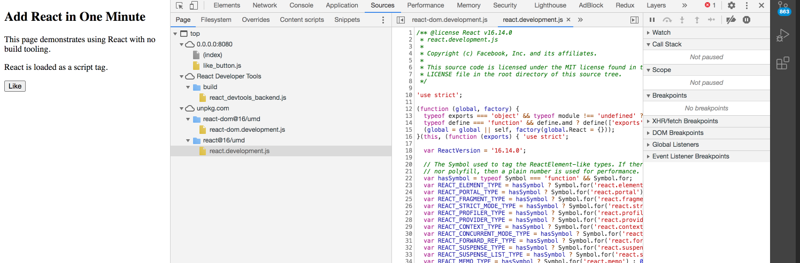

# react-building
https://dev.to/ameerthehacker/build-your-own-react-in-90-lines-of-javascript-1je2

React랑 좀더 친숙해지면 친숙해질수록 솔직히 이거 왜 이렇게 돌아가는건지 모르겠다. 

그러던 중 위의 예제를 찾게 되서 대체 뭔지 모를 이것을 나도 한번 만들어보려고 한다!!

"What I cannot create, I do not understand - Richard Feynman"

## 우선 React 다시한번 보기
https://reactjs.org/docs/add-react-to-a-website.html 여기서 script태그로 react를 로드해봤다. react가 정확히 어떻게 어떤코드가 도는건질 아직도 잘 모르겠다. 



이렇게 개발자 도구탭을 열어보면 소스가 이렇게 떠 있다. react-dom과 react를 로드해오고 있다. 


cra로 만든 앱을 보면 번들러가 알아서 react랑 react-dom을 갖고왔다. [난데없이 코드 스플리팅 관련해서 읽은 글](https://velog.io/@velopert/react-code-splitting) 

* 추가
  * [ReactJs server-side rendering vs client-side rendering](https://stackoverflow.com/questions/27290354/reactjs-server-side-rendering-vs-client-side-rendering)
  * [정적사이트란](https://blog.lgcns.com/2336)
  * [React 진짜 모르겠어서 질문한번 남겨봄](https://stackoverflow.com/questions/65410088/react-how-does-it-work-on-gatsby-and-nextjs)

## 후기
vdom을 이렇게 따로 써보니까 어떤식으로 비교하고 업데이트 되는지 좀더 파악이 되는거같다. 뭔가 리액트랑 좀더 가까워진 오늘 하루~! 하지만 아직 next js동작원리는 감도 안온다!!! 나중에 아마 여기서 구현한거 다 까먹겠지만, 그때와서 다시 보면 좀더 알기 좋지 않을까 싶다. 여튼 이제 리액트는 어떻게 돌아간다는 건지 알겠는데, react가 ssr에서 어떻게 쓰인단건지 아직도 감이 잘안오는것같다!! 이건 다음에 또 공부하는걸로!

## React에서 구현해야하는 요소들
- https://github.com/ameerthehacker/webpack-starter-pack 를 바탕으로 시작
- [stabbdom](https://github.com/snabbdom/snabbdom): Vue js에서 쓰는 vdom이라는데, patch를 통해 이전 vnode와 다음 vnode를 비교하고 업데이트 한다. Let us now create and return our virtual DOM node whenever QndReact.createElement(...) is called
  
1. JSX
JSX는 @babel/plugin-transform-react-jsx 플러그인을 통해 React.createElement(...)으로 변한다. 

2. Functional components


3. Class components with state


4. Lifecycle Hooks - 이 예제에서는 only the componenetDidMount()


```
python3 -m venv .env
. .env/bin/activate
python -m http.server 8080
```
